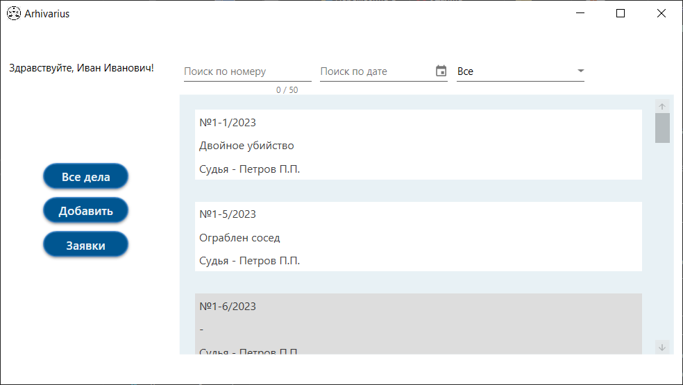

<!-- Improved compatibility of back to top link: See: https://github.com/othneildrew/Best-README-Template/pull/73 -->

<!--
*** Thanks for checking out the Best-README-Template. If you have a suggestion
*** that would make this better, please fork the repo and create a pull request
*** or simply open an issue with the tag "enhancement".
*** Don't forget to give the project a star!
*** Thanks again! Now go create something AMAZING! :D
-->

<!-- PROJECT SHIELDS -->
<!--
*** I'm using markdown "reference style" links for readability.
*** Reference links are enclosed in brackets [ ] instead of parentheses ( ).
*** See the bottom of this document for the declaration of the reference variables
*** for contributors-url, forks-url, etc. This is an optional, concise syntax you may use.
*** https://www.markdownguide.org/basic-syntax/#reference-style-links
-->

<!-- PROJECT LOGO -->
 

  
  <h1>
    Arhivarius
  </h1>
  

    Проект представляет собой АРМ секретаря судебного архива.
  

  

    Возможности системы:    
  

  <ol>
    <li>Ввод, хранение, поиск и обработку информации о судебных делах сданных в архив</li>
    <li>Автоматическое добавление в БД актов о сдаче дела в архив и запросе дела из архива.</li>
    <li>Автоматическая компоновка отчетной документации</li>
    <li>Автоматический учет состояний дел в архиве</li>
    <li>Учет запросов по архивным документам</li>
  </ol>

### Создан с

(<a href="#readme-top">Наверх</a>)

<!-- GETTING STARTED -->
## Начало работы

Для установки скачайте необходимую версию с [https://github.com/MurzinDmitrii/Archivarius]

<!-- USAGE EXAMPLES -->
## Использование

Приложение позволяет отслеживать хранимые в архиве дела

При необходимости дела добавляются/редактируются

В системе ведется учет заявок на дела из архива

(<a href="#readme-top">Наверх</a>)

<!-- CONTRIBUTING -->
## Вклад

Вклад - это то, что делает сообщество с открытым исходным кодом таким замечательным местом для обучения, вдохновения и творчества. Мы очень ценим любой ваш вклад.

Если у вас есть предложения, которые могли бы улучшить это, пожалуйста, разветвляйте репозиторий и создайте запрос на извлечение. Вы также можете просто открыть проблему с тегом "улучшение". Не забудьте поставить проекту звездочку! Еще раз спасибо!

1. Разветвляем проект
2. Создайте свою функциональную ветку (`git checkout -b feature/AmazingFeature`)
3. Зафиксируйте внесенные изменения (`git commit -m 'Add some AmazingFeature'`)
4. Отправить в ветку (`git push origin feature/AmazingFeature`)
5. Открыть запрос на извлечение

(<a href="#readme-top">Наверх</a>)

<!-- LICENSE -->
## Лицензия

DРаспространяется по лицензии MIT. Смотрите `LICENSE.txt` для получения дополнительной информации.

(<a href="#readme-top">Наверх</a>)

<!-- CONTACT -->
## Контакты

Почта для связи - [@twitter_handle](https://twitter.com/twitter_handle) - dmitriymyrzin0908@gmail.com

Ссылка на проект: [https://github.com/github_username/repo_name](https://github.com/MurzinDmitrii/Archivarius)

(<a href="#readme-top">Наверх</a>)

<!-- MARKDOWN LINKS & IMAGES -->
<!-- https://www.markdownguide.org/basic-syntax/#reference-style-links -->
[contributors-shield]: https://img.shields.io/github/contributors/github_username/repo_name.svg?style=for-the-badge
[contributors-url]: https://github.com/github_username/repo_name/graphs/contributors
[forks-shield]: https://img.shields.io/github/forks/github_username/repo_name.svg?style=for-the-badge
[forks-url]: https://github.com/github_username/repo_name/network/members
[stars-shield]: https://img.shields.io/github/stars/github_username/repo_name.svg?style=for-the-badge
[stars-url]: https://github.com/github_username/repo_name/stargazers
[issues-shield]: https://img.shields.io/github/issues/github_username/repo_name.svg?style=for-the-badge
[issues-url]: https://github.com/github_username/repo_name/issues
[license-shield]: https://img.shields.io/github/license/github_username/repo_name.svg?style=for-the-badge
[license-url]: https://github.com/github_username/repo_name/blob/master/LICENSE.txt
[linkedin-shield]: https://img.shields.io/badge/-LinkedIn-black.svg?style=for-the-badge&logo=linkedin&colorB=555
[linkedin-url]: https://linkedin.com/in/linkedin_username
[product-screenshot]: images/screenshot.png
[sharplogo]: image/sharplogo.png
[sharp-url]: https://learn.microsoft.com/ru-ru/dotnet/csharp/
[mssqllogo]: https://img.shields.io/badge/React-20232A?style=for-the-badge&logo=react&logoColor=61DAFB
[mssql-url]: https://www.microsoft.com/ru-ru/sql-server/
[allcasepagephoto]: image/allcasepagephoto.png
[addcasepagephoto]: image/addcasepagephoto.png
[allquerypagephoto]: image/allquerypagephoto.png